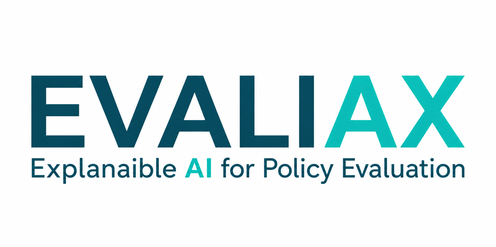

# Research

Replication code and data for our research in applied economics and policy evaluation. Each subdirectory contains a self-contained project with its own README, code, and (where licensing allows) data.

</p>
<p align="center">
  
</p>

## Contents

| Project | Topic | Status | Reference |
|---------|-------|--------|-----------|
| `kit-digital-transparent-cml/` | Transparent policy evaluation through causal ML: SME digital subsidies | Data & Policy (under review) |
Data are not redistributed where licensing prohibits it, see each project's README for how to obtain the inputs.

New projects will be added as the corresponding papers are completed.

## Repository structure

Each project follows the same layout:

```
project-name/
├── README.md           Description, data sources, how to reproduce
├── code/               Analysis scripts (Python, R, or Stata)
├── data/               Raw and processed data, when licensing permits
├── output/             Tables and figures generated by the code
└── paper/              Manuscript and supplementary materials
```

When data cannot be shared due to licensing or confidentiality restrictions (for example, firm-level administrative records under access agreements), the project README documents how to request access and provides synthetic data for code testing.

## How to reproduce

Each project specifies its software requirements in its own README. As a general rule:

- Python projects include a `requirements.txt` or `environment.yml`.

Clone the repository and follow the instructions in the project-level README:

```bash
git clone https://github.com/USERNAME/research.git
cd research/project-name
```

## Data availability

Where data are public, they are included in the repository or downloaded by the replication scripts. Where data are proprietary or restricted, the project README documents the source, the access procedure, and the variables used.

## Citation

If you use code or results from this repository, please cite the corresponding paper. Each project README provides a suggested citation.

## License

Code is released under the MIT License (see `LICENSE`). Data are subject to the licensing terms of their original sources, documented at the project level.

## Authors

Eugeni Gil-Ocana<br>
Universitat Politècnica de València<br>
[Website](https://eugenigil.github.io/) · [Google Scholar](https://scholar.google.com/citations?user=iCdLpc8AAAAJ&hl=en)

Ana Garcia-Bernabeu<br>
Universitat Politècnica de València<br>
[Google Scholar](https://scholar.google.es/citations?user=qY0Vh7gAAAAJ&hl=es)

Pablo de Pedraza<br>
Universitat Politècnica de València<br>
[Google Scholar](https://scholar.google.es/citations?user=XA2Mnj8AAAAJ&hl=es)
